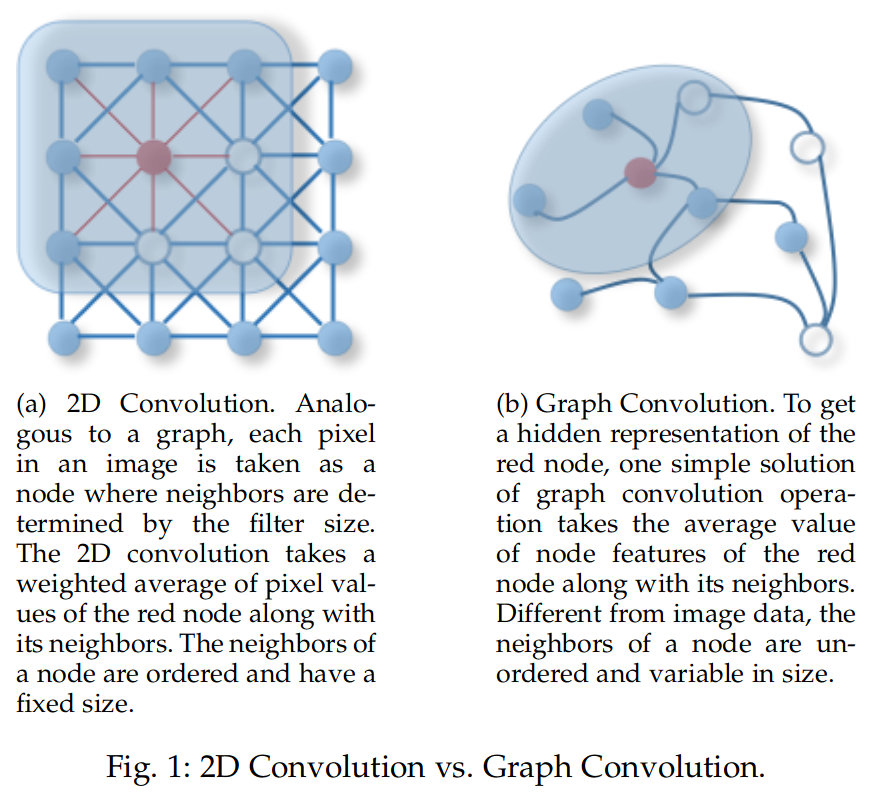
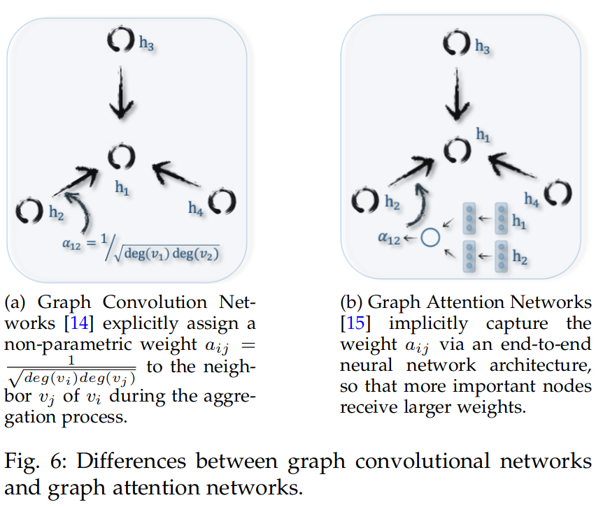
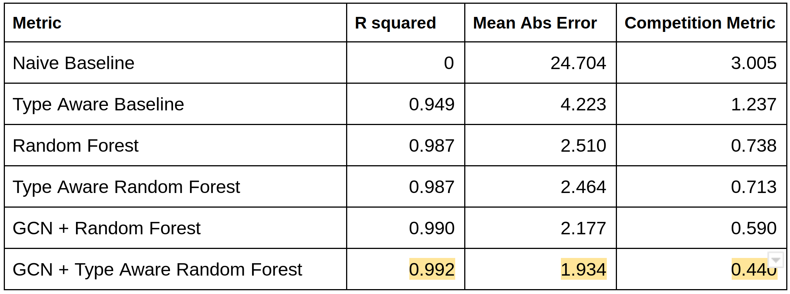

# PredictingMolecularProperties

This repository is for a [kaggle challenge](https://www.kaggle.com/c/champs-scalar-coupling/overview/evaluation), which aims to develop an algorithm that can predict the magnetic interaction between two atoms in a molecule (i.e., the scalar coupling constant) given the composition and structure of the relevant molecules. 

###### *I have used jupyter notebooks for all the work because of ease of presentation and readbility.

### EDA
[Notebook](https://github.com/muaz-urwa/PredictingMolecularProperties/blob/master/ExploratoyDataAnalysis.ipynb)

Exploratory Data Analysis yields following conclusions:
- Coupling type, atom type and euclidean distance are best pridictors and thus important features.
- Corelation analysis shows that there are only few weak linear dependencies and thus non-linear modeling should be preferred.
- it is intuitive to think that spatial correlations, proximities to other atoms and composition of molecule should play a role in the coupling coefficient. So thorough experiment driven feature engineering which incorporate the surrounding information of the atoms involved in feature space will improve the performance. 
- Other alternatives to avoiding manual feature engineering are using 3d convolutions to capture spatial relationships, or using graph convolution to capture structural relationships.

### Relevant Literature

Molecules can easily be represented as graphs of interconnected atoms[2][3]. Since the properties of the atoms dont depend on atoms in isolations, the spatial and structural dependency needs to be modelled in some way.

Convolutional neural networks have been the champions of modelling complex spatial relatonships and have found great success in domains using euclidean data like images. The molecules can be represented as 3d image like matrices with channel vectors to hold the properties, and the resulting representation can be passed through convolutional neural networks for deep feature representation. But the matrices would be really sparse and back propagation does not do well with sparse input. Furthermore, graph is more accurate representation for molecules that images in euclidean domain. 

"Inspired by the huge success of convolutional networks in the computer vision domain, a large number of methods that re-define the notation of convolution for graph data have emerged recently. These approaches are under the umbrella of graph convolutional networks (GCNs)."[3]

Convolution operation for graphs has been yeilding state of the art performance for many tasks where data has underlying grpahical structure. This operator accounts for both spatial and structural dependencies. Similarly, graph attention networks have also been developed. These methods have been applied to molecular graphs recently with great success. [1][2][4]

### Modelling
[Notebook](https://github.com/muaz-urwa/PredictingMolecularProperties/blob/master/ExploratoyDataAnalysis.ipynb)

First we should establish baselines for comparative analysis of more sophisticated methods. First baseline is the naive baseline which predicts traiing data mean as the coupling coefficient for all test inferences. A slightly better baseline model uses the mean of relevant coupling type training examples as the prediction. 

#### Random Forest
[Notebook](https://github.com/muaz-urwa/PredictingMolecularProperties/blob/master/Modelling.ipynb)

Among the non linear modelling methods tree based ensembles are most robust to choice of hyperparameters and good default models for most type of problems. Furhtermore, they dont require data treatment like normalization and architectural choices are not tough like neural networks. Without time constraints, I would do extensive hyperparameter tuning.

#### CNN
[Notebook](https://github.com/muaz-urwa/PredictingMolecularProperties/blob/master/CNNApproach.ipynb)

The idea was to represent each molecule as a 3d matrix, with each cell corresponding to a location in 3d space. Then embedd the atoms in the correct cells and using 4th dimension (channel) to hold feature vector (hot encoded atom type and binary flag for the atoms whose coupling is under question). Then a CNN composed of multiple 3d convoluton layers would be trained for the regression problem. But this data representation was compute adn memory intensive (due to large amount of floating point matrices), and it was taking too long to form the matrices. I gave up the idea due to time constraints, half cooked note book can be found above.

#### GCN inspired feature extraction and Random Forest
[Notebook](https://github.com/muaz-urwa/PredictingMolecularProperties/blob/master/GraphConvolution.ipynb)

Since the connectivity and bond information is not provided for molecules I assume a fully connected graph. Spatial Graphical conolution is a local aggregation operator that aggrgates the information of center node with neighbouring nodes to form a representation of that node. Fore more details read [3]. I developed a local aggregator that scales the neighbouring atoms features by its euclidean distance. 

1stOrderFeature = Feature + SumOverAtoms(AtomFeature / AtomEuclideanDistance)

I computer first order and second order graphical convolution features for each atom. The features contain information about the neighbouring atom types and their proximity. Random forest classifier based on these features was trained.

### Results

Following conclusions can be made:
- it can be seen that traiing seperate models for diferent coupling types yileds better performance for all methods.
- GCN based features yield superior performance since they use infromation about neghbouring atoms.

These were just preliminary raw attempts at modelling, I am sure there is a lot ot room of iterative improvement through hyperaparamter tuning and more sophisticated feature engineering for these models.

#### References:
1) [Neural Message Passing for Quantum Chemistry](https://arxiv.org/abs/1704.01212)
2) [Molecular Graph Convolutions:  Moving Beyond Fingerprints](https://arxiv.org/abs/1603.00856)
3) [A Comprehensive Survey on Graph NeuralNetworks](https://arxiv.org/pdf/1901.00596.pdf)
4) [Convolutional Networks on Graphsfor Learning Molecular Fingerprints](https://papers.nips.cc/paper/5954-convolutional-networks-on-graphs-for-learning-molecular-fingerprints.pdf)
